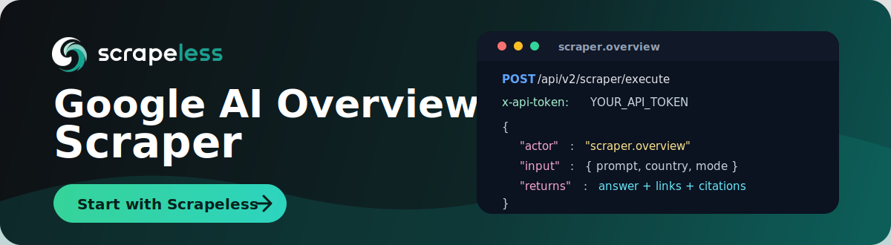

# Google AI Overview Scraper

<p align="center">
  <a href="https://app.scrapeless.com/passport/login?redirect=/quick-start&utm_source=github&utm_medium=repo&utm_campaign=google_ai_overview_scraper" target="_blank">
    
  </a>
</p>

<p align="center">
  <a href="https://app.scrapeless.com/passport/login?redirect=/quick-start&utm_source=github&utm_medium=repo&utm_campaign=google_ai_overview_scraper">
    
  </a>
  <a href="https://www.scrapeless.com/en/blog?utm_source=github&utm_medium=repo&utm_campaign=google_ai_overview_scraper">
    
  </a>
  <a href="https://x.com/Scrapelessteam">
    
  </a>
  <a href="https://www.linkedin.com/company/scrapeless/">
    
  </a>
</p>

Collect Google AI Overview answers through the **Scrapeless LLM Chat Scraper** API, including the Markdown response, citation sources, web sources, shopping products, and ads, without reverse-engineering the Google Search UI, maintaining browsers, or building your own anti-blocking stack.

Use this repo when you need a repeatable way to monitor Google AI Overview answers for GEO and AI search visibility, compare prompts across regions, audit cited sources, track embedded shopping products, or pipe AI Overview responses into analytics and automation workflows.

- **Full documentation:** https://docs.scrapeless.com/en/llm-chat-scraper/quickstart/introduction/
- **Get your `x-api-token`:** https://app.scrapeless.com/passport/login?redirect=/quick-start
- **API endpoint:** `POST https://api.scrapeless.com/api/v2/scraper/execute`

## How it works

Send a single `POST` request to the Scrapeless endpoint with your API token in
the `x-api-token` header. The body specifies the actor (`scraper.overview`) and
an `input` object with your prompt and options. The API runs the query and
returns the structured result in `task_result`.

```http
POST https://api.scrapeless.com/api/v2/scraper/execute
Content-Type: application/json
x-api-token: <YOUR_API_TOKEN>
```

## Quick start (curl)

```bash
curl 'https://api.scrapeless.com/api/v2/scraper/execute' \
  --header 'Content-Type: application/json' \
  --header 'x-api-token: YOUR_API_TOKEN' \
  --data '{
    "actor": "scraper.overview",
    "input": {
      "prompt": "Recommended attractions in New York",
      "country": "US",
      "shopping": true
    }
  }'
```

To receive the result asynchronously, add a `webhook` object:

```json
"webhook": { "url": "https://www.your-webhook.com" }
```

## Request parameters

The request body has three top-level fields: `actor` (always `scraper.overview`),
`input` (below), and an optional `webhook`.

| Parameter (`input.*`) | Type    | Required | Description                                                                                       |
| --------------------- | ------- | -------- | ------------------------------------------------------------------------------------------------- |
| `prompt`              | string  | Yes      | Prompt sent to Google AI Overview.                                                                |
| `country`             | string  | Yes      | Country / region code (e.g. `US`, `JP`).                                                          |
| `shopping`            | boolean | No       | Fetch shopping data. Defaults to `true`. When enabled, product info is returned in `products`.    |
| `location`            | string  | No       | Google canonical location name for geo-targeted results (e.g. `New York,New York,United States`). See [Google's geo target list](https://developers.google.com/google-ads/api/data/geotargets). Mutually exclusive with `uule`. |
| `uule`                | string  | No       | Pre-encoded Google UULE string for precise geo-targeting. Use when you have a pre-built UULE value instead of a location name. Mutually exclusive with `location`. |

> **Billing note:** When the response includes shopping data (the `products`
> field), the call is charged at **2× the base rate** due to the extra work of
> extracting product information from multiple sources.

> **Overview not triggered:** When Google AI Overview mode is not triggered for
> a query, both `content` and `rawtext` come back as empty strings. Try adjusting
> your prompt or use keywords that are covered by Google Overview.

## Response

A successful call returns a status envelope; the scraped data lives in
`task_result`:

```json
{
  "status": "success",
  "task_id": "e705743d-da2e-4163-9ccd-eef62529ff72",
  "task_result": {
    "content": "...markdown answer...",
    "rawtext": "...original answer text...",
    "metadata": { "rawUrl": "https://..." },
    "is_overview_shopping": true,
    "products": [],
    "source": [
      { "title": "...", "url": "https://...", "website_name": "...", "snippet": "..." }
    ],
    "web_source": [],
    "ads": []
  }
}
```

### Top-level fields

| Field         | Type   | Description                                    |
| ------------- | ------ | ---------------------------------------------- |
| `status`      | string | Request status, e.g. `success`.                |
| `task_id`     | string | Unique identifier for the task.                |
| `task_result` | object | Scraped result (fields below).                 |

### `task_result` fields

| Field                  | Type    | Description                                                                                     |
| ---------------------- | ------- | ----------------------------------------------------------------------------------------------- |
| `content`              | string  | Answer body in Markdown format. **Empty string when overview mode is not triggered.**           |
| `rawtext`              | string  | Original answer text. **Empty string when overview mode is not triggered.**                     |
| `metadata`             | object  | Metadata information (e.g. `metadata.rawUrl`, the source webpage URL).                           |
| `is_overview_shopping` | boolean | Whether the overview contains embedded shopping data.                                           |
| `products`             | array   | Product data (present when `shopping` is enabled). Key subfields: `title`, `url`, `img`, `rating`, `review_count`, `seller`, `total_price`, `orig_price`, `discount`, `delivery`, `stores`. |
| `source`               | array   | Citation sources. Key subfields: `title`, `url`, `website_name`, `snippet`, `favicon`, `thumbnail`, `type`. |
| `web_source`           | array   | Web search sources. Key subfields: `title`, `url`, `website_name`, `snippet`, `favicon`, `thumbnail`. |
| `ads`                  | array   | Advertisements. Key subfields: `title`, `url`, `display_url`, `advertiser`, `description`, `price`, `google_ad_url`, `site_links`. |

For the complete field list (product offers, store pricing, source metadata, ad
cards, site links, etc.), see the [official documentation](https://docs.scrapeless.com/en/llm-chat-scraper/quickstart/introduction/).

## Code examples

Ready-to-run examples live in [`examples/`](./examples):

| Language | File                                       | Run                                   |
| -------- | ------------------------------------------ | ------------------------------------- |
| Python   | [`example.py`](./examples/example.py)      | `pip install requests && python example.py` |
| Node.js  | [`example.js`](./examples/example.js)      | `node example.js` (Node 18+)          |
| Go       | [`example.go`](./examples/example.go)      | `go run example.go`                   |
| Java     | [`Example.java`](./examples/Example.java)  | `java Example.java` (Java 11+)        |
| PHP      | [`example.php`](./examples/example.php)    | `php example.php`                     |

All examples read the token from the `SCRAPELESS_API_TOKEN` environment variable:

```bash
export SCRAPELESS_API_TOKEN="your_api_token"
```

## Practical use cases

### AI answer monitoring

Track how Google AI Overview responds to your brand, product category, documentation topics, or competitor prompts. Store the Markdown answer, citation sources, and web sources so your team can measure AI visibility over time.

### GEO and SEO research

Run the same prompt across countries and geo-targeted locations to compare which sources Google AI Overview cites, how recommendations change by region, and where your content appears in AI-generated answers.

### Shopping and product intelligence

Enable `shopping` to capture embedded product data — titles, prices, discounts, sellers, ratings, and store offers — so you can monitor how products surface inside Google AI Overview and how pricing and availability shift over time.

### Dataset and workflow automation

Pipe Google AI Overview answers into internal dashboards, knowledge-base QA systems, spreadsheets, data warehouses, or alerting workflows through the synchronous API response or webhook callback.

## Why use Scrapeless for Google AI Overview scraping?

| Benefit | What it means for your team |
| ------- | --------------------------- |
| One unified API | Query Google AI Overview through the same Scrapeless LLM Chat Scraper workflow used for other AI answer engines. |
| Structured output | Receive Markdown answers, citation sources, web sources, shopping products, and ads in a developer-friendly response. |
| Less maintenance | Avoid building browser automation, UI selectors, proxy rotation, retries, and anti-blocking logic yourself. |
| Region-aware analysis | Use country, location, and UULE inputs to compare localized AI answers and source citations. |
| Production integration | Use API tokens, webhooks, and language examples to connect Google AI Overview data to real applications quickly. |

## FAQ

### What is Google AI Overview Scraper?

Google AI Overview Scraper is a Scrapeless LLM Chat Scraper actor that sends prompts to Google AI Overview and returns structured answer data, including the Markdown response, raw text, citation sources, web sources, shopping products, and ads.

### Do I need to run a browser or proxy pool?

No. This repo shows how to call the Scrapeless API. Scrapeless handles the scraping workflow behind the API, so your application only needs to send requests and process the returned data.

### Why is `content` empty?

Google AI Overview mode is not triggered for every query. When it does not trigger, both `content` and `rawtext` come back as empty strings. Try rephrasing your prompt or using keywords and topics that are commonly covered by Google AI Overview. You can also target a specific region with `country`, `location`, or `uule` to influence whether an overview appears.

### Can I get results asynchronously?

Yes. Add a `webhook` object with your callback URL to receive results asynchronously when the task completes.

### Is this suitable for AI search visibility monitoring?

Yes. The response includes AI-generated Markdown, citation sources, web sources, and embedded shopping data, which makes it useful for GEO analysis, brand monitoring, source tracking, and competitive research.

### What should I consider before using AI scraping in production?

Make sure your use case complies with applicable laws, platform terms, privacy requirements, and your organization's data policies. Avoid collecting sensitive, private, or unauthorized information.

## Learn more

- [Scrapeless LLM Chat Scraper documentation](https://docs.scrapeless.com/en/llm-chat-scraper/quickstart/introduction/)
- [Supported LLM Chat Scraper actors](https://docs.scrapeless.com/en/llm-chat-scraper/quickstart/introduction/)
- [Scrapeless dashboard](https://app.scrapeless.com/passport/login?redirect=/quick-start)
- [Scrapeless website](https://www.scrapeless.com/en)

## Contact us

Need help building a Google AI Overview monitoring workflow or scaling AI answer collection?

- Join our [Discord](https://discord.gg/VU2vtbq7Q2).
- Contact us on [Telegram](https://t.me/scrapeless).
- For repo-specific issues or improvements, open an issue or pull request in this repository.
